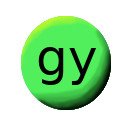

  

# gy php framework

### Установка  gy php framework:
- Установить пока можно php скриптом https://github.com/ssv32/install-gy-php-framework ;
- После установки необходимо задать настройки ядра gy framework, это можно сделать скриптом gy/install/consoleInstallOptions.php 
  (или в файле /gy/config/gy_config.php);
- Затем надо установить необходимое в базу данных (пока mysql) скриптом gy/install/installMysqlTable.php (предварительно нужно создать БД и задать доступы и её имя на шаге выше).

### Пример подключения gy php framework
`<?` 
`include "./gy/gy.php"; // подключить ядро // include core` 

### Пример проверки подключено ли ядро gy php framework
`<?if ( !defined("GY_GLOBAL_FLAG_CORE_INCLUDE") && (GY_GLOBAL_FLAG_CORE_INCLUDE !== true) ) die( "gy: err include core" );?>`

### Пример вызова компонента:
`<?` 
`include "./gy/gy.php"; // подключить ядро // include core` 
 
`// пример вызова компонента // example run component` 
`$app->component(` 
`⋅⋅⋅⋅'form_auth',` 
`⋅⋅⋅⋅'0',` 
`⋅⋅⋅⋅array( ` 
`⋅⋅⋅⋅⋅⋅⋅⋅'test' => 'asd',` 
`⋅⋅⋅⋅⋅⋅⋅⋅'idComponent' => 1,` 
`⋅⋅⋅⋅),` 
`);` 
 
 
 

-----
Имеются файлы wiki по работе с framework, описанием реализованного (с точки зрения админки и пояснения для разработчиков)
https://github.com/ssv32/gy/wiki

-----
Также gy php framework имеет элементы CMS, это админка и прочее для управления контентом на страницах.

-----
gy php framework протестирован и будет работать на php версиях (необходимо скомпилировать PHP с графической библиотекой GD): 
5.6 
7.0 
7.1 
 
